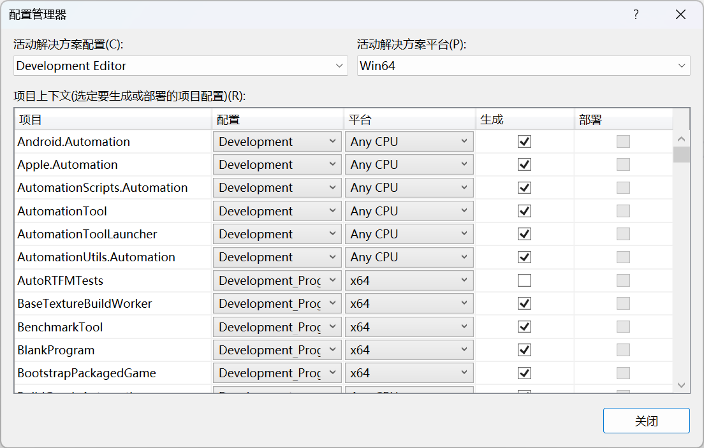
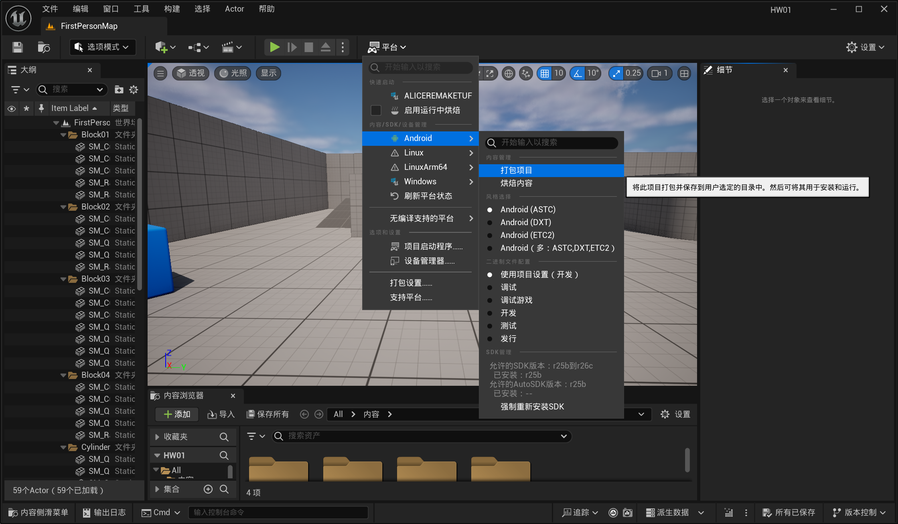

# HW01

## 作业内容

编译UE5.4.4的源码并打包一个安卓应用

## 打包的apk文件

https://share.weiyun.com/2jLrQioa

## 编译UE5.4.4

### 获取源码

在github上加入Epic Games https://www.unrealengine.com/zh-CN/ue-on-github

克隆UE5.4.4的源码

```bash
git clone --depth=1 -b 5.4.4-release https://github.com/EpicGames/UnrealEngine.git
```

进入UE5.4.4的项目目录

```bash
cd UnrealEngine
```

下载二进制依赖

```bash
./Setup.bat
```

生成项目

```bash
./GenearateProjectFiles.bat
```

下载VS 2022并安装相应的组件


### 编译源码

最新版Visual Studio 2022 NuGet包报错问题解决方案

这里已经解决了，就不放图了。主要是NU1903和NU1904报错

在每个报错的`.csproj`文件的`<PropertyGroup></PropertyGroup>`标签中，加入`<NuGetAudit>false</NuGetAudit>`

https://learn.microsoft.com/en-us/nuget/reference/errors-and-warnings/nu1901-nu1904

显示AutoRTFMTests出错，在生成的配置管理器中取消勾选AutoRTFMTests的生成



将UE5设置为启动项目，并生成

安装Visual Studio Integration Tool

https://learn.microsoft.com/en-us/visualstudio/gamedev/unreal/get-started/vs-tools-unreal-install

https://github.com/microsoft/vc-ue-extensions

进入UE5.4.4源码的Engine/Plugins目录

```bash
git clone https://github.com/microsoft/vc-ue-extensions.git
```

然后直接重新生成UE5即可

## 打包Android应用

首先创建一个fps模板，选择C++。


安装Andriod Studio，按装Android SDK Command-line Tools 


下载gradle，gradle直接下载不下来的解决方案：手动下载对应版本的gradle的zip文件，放在`.gradle/wrapper/dists/gradle-7.5-all/一串数字`文件夹下，以我的为例

```
C:\Users\AliceRemake\.gradle\wrapper\dists\gradle-7.5-all\6qsw290k5lz422uaf8jf6m7co
```

在项目的设置里接受Android的License


java版本不匹配问题的解决方案：在项目的Android SDK中设置对应版本java的路径


在编辑器的平台选择打包Android


